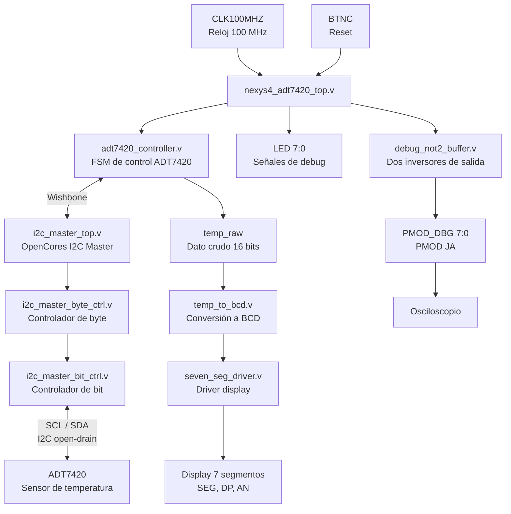
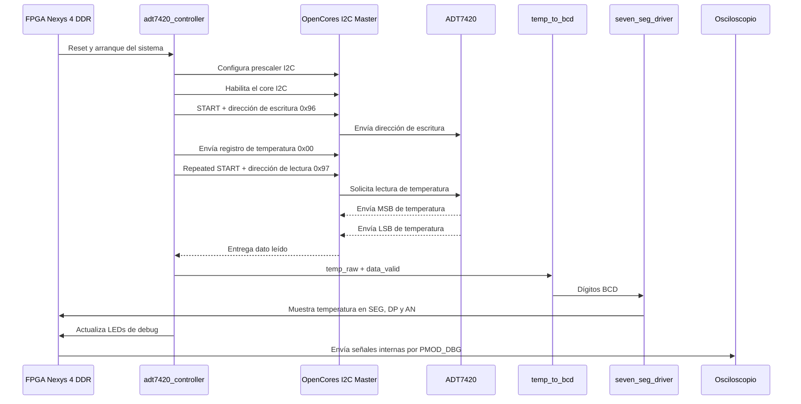
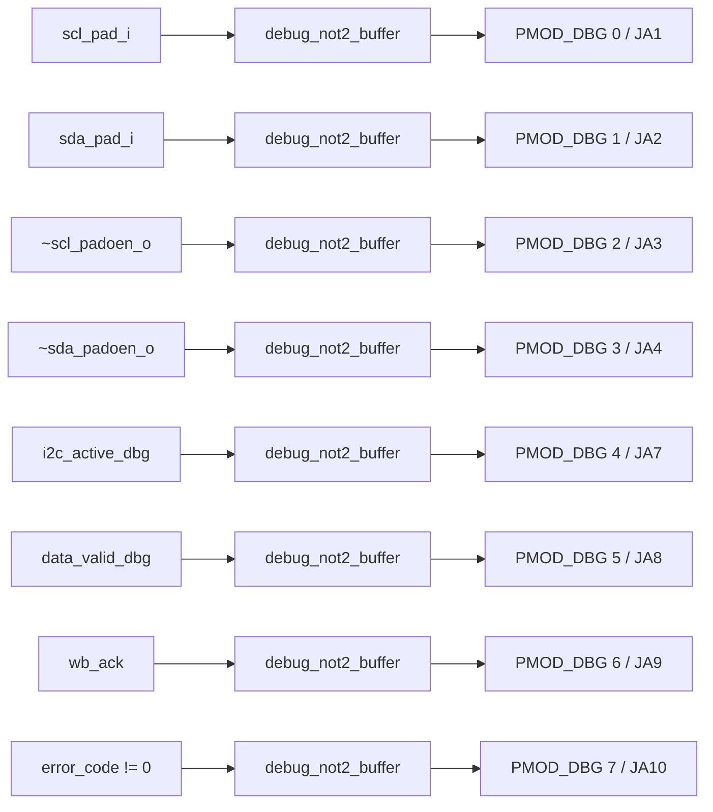
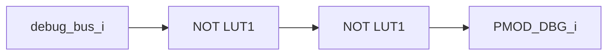

# FPGA OpenCores I2C ADT7420 Temperature Monitor

Este proyecto implementa y valida el funcionamiento del núcleo **OpenCores I2C Master** en una FPGA **Nexys 4 DDR**, utilizando comunicación I2C con el sensor de temperatura **ADT7420** integrado en la tarjeta.

El sistema lee la temperatura por I2C, convierte el dato crudo a formato decimal BCD y muestra el resultado en el display de 7 segmentos. Además, se agregaron salidas de depuración por **PMOD JA** para observar señales internas mediante un osciloscopio.

---

## Objetivo del proyecto

El objetivo principal es comprobar el funcionamiento del núcleo **OpenCores I2C Master** mediante una aplicación real de adquisición de datos: la lectura del sensor ADT7420 por I2C y la visualización de la temperatura en el display de la FPGA.

El proyecto permite validar:

- Configuración del core I2C mediante una interfaz tipo Wishbone.
- Comunicación I2C con el sensor de temperatura ADT7420.
- Lectura del registro de temperatura del sensor.
- Conversión del dato crudo de temperatura a formato BCD.
- Visualización de la temperatura en el display de 7 segmentos.
- Depuración de señales internas mediante PMOD JA y osciloscopio.
- Uso correcto de líneas I2C tipo open-drain mediante primitivas `IOBUF`.

---

## Plataforma utilizada

| Elemento | Descripción |
|---|---|
| Tarjeta FPGA | Digilent Nexys 4 DDR |
| FPGA | Xilinx Artix-7 |
| Sensor | ADT7420 integrado en la tarjeta |
| Interfaz de comunicación | I2C |
| Núcleo I2C | OpenCores I2C Master |
| Interfaz interna | Wishbone |
| Reloj del sistema | 100 MHz |
| Frecuencia I2C | 100 kHz |
| Lenguaje | Verilog HDL |
| Herramienta | Xilinx Vivado |

---

## Estructura del repositorio

```text
FpgaOpencoresI2cA7420/
│
├── README.md
├── .gitignore
│
├── rtl/
│   ├── nexys4_adt7420_top.v
│   ├── adt7420_controller.v
│   ├── temp_to_bcd.v
│   ├── seven_seg_driver.v
│   ├── debug_not2_buffer.v
│   ├── i2c_master_top.v
│   ├── i2c_master_bit_ctrl.v
│   ├── i2c_master_byte_ctrl.v
│   ├── i2c_master_defines.v
│   └── timescale.v
│
├── constraints/
│   └── nexys4_adt7420.xdc
│
├── sim/
│   └── tb_sistema_final.v
│
└── docs/
```

---

## Ubicación y función de cada archivo

| Archivo | Función |
|---|---|
| `rtl/nexys4_adt7420_top.v` | Módulo superior del sistema. Conecta el core I2C, controlador ADT7420, conversor BCD, display de 7 segmentos, LEDs y salidas PMOD de depuración. |
| `rtl/adt7420_controller.v` | Máquina de estados finitos que controla la lectura del ADT7420 mediante el core I2C y la interfaz Wishbone. |
| `rtl/temp_to_bcd.v` | Convierte el dato crudo de temperatura entregado por el sensor a dígitos decimales BCD. |
| `rtl/seven_seg_driver.v` | Driver multiplexado para el display de 7 segmentos de la Nexys 4 DDR. |
| `rtl/debug_not2_buffer.v` | Módulo de depuración que saca señales internas al PMOD usando dos inversores protegidos contra optimización. |
| `rtl/i2c_master_top.v` | Núcleo principal OpenCores I2C Master. |
| `rtl/i2c_master_byte_ctrl.v` | Controlador de byte del núcleo I2C. Maneja transmisión, recepción y acknowledge. |
| `rtl/i2c_master_bit_ctrl.v` | Controlador de bit del núcleo I2C. Genera la actividad sobre SCL y SDA. |
| `rtl/i2c_master_defines.v` | Archivo de definiciones internas del core I2C. |
| `rtl/timescale.v` | Archivo de escala de tiempo para simulación. |
| `constraints/nexys4_adt7420.xdc` | Archivo de constraints con asignación de pines para reloj, reset, I2C, display, LEDs y PMOD JA. |
| `sim/tb_sistema_final.v` | Testbench para validar el comportamiento del sistema en simulación. |
| `docs/` | Carpeta reservada para imágenes, capturas del osciloscopio, diagramas o resultados adicionales. |

---

## Diagrama general del sistema



---

## Flujo de operación



---

## Módulo superior

El módulo principal del diseño es:

```verilog
nexys4_adt7420_top
```

Este módulo integra todos los bloques del sistema:

- Core I2C de OpenCores.
- Controlador del sensor ADT7420.
- Conversor de temperatura a BCD.
- Driver del display de 7 segmentos.
- LEDs de depuración.
- Salidas PMOD para osciloscopio.

---

## Entradas del módulo superior

| Señal | Tipo | Descripción |
|---|---|---|
| `CLK100MHZ` | Entrada | Reloj principal de 100 MHz de la Nexys 4 DDR. |
| `BTNC` | Entrada | Botón central usado como reset. Es activo alto físicamente. |

---

## Señales bidireccionales

| Señal | Tipo | Descripción |
|---|---|---|
| `I2C_SCL` | Inout | Línea de reloj I2C conectada al ADT7420. |
| `I2C_SDA` | Inout | Línea de datos I2C conectada al ADT7420. |

Las líneas `I2C_SCL` e `I2C_SDA` son de tipo **open-drain**, por lo que se manejan mediante primitivas `IOBUF`.

---

## Salidas del módulo superior

| Señal | Tipo | Descripción |
|---|---|---|
| `SEG[6:0]` | Salida | Segmentos del display de 7 segmentos. |
| `DP` | Salida | Punto decimal del display. |
| `AN[7:0]` | Salida | Ánodos del display multiplexado. |
| `LED[7:0]` | Salida | LEDs de depuración visual. |
| `PMOD_DBG[7:0]` | Salida | Señales internas enviadas al PMOD JA para medición con osciloscopio. |

---

## Dirección I2C del ADT7420

Para el sensor ADT7420 integrado en la Nexys 4 DDR se utiliza la siguiente dirección:

```verilog
7-bit address = 0x4B
write address = 0x96
read address  = 0x97
```

La lectura se realiza desde el registro de temperatura:

```verilog
ADT_REG_TMP = 8'h00
```

---

## Secuencia I2C implementada

La FSM del módulo `adt7420_controller.v` realiza la siguiente secuencia:

1. Configura el prescaler del core I2C.
2. Habilita el core I2C.
3. Envía condición `START`.
4. Envía dirección de escritura del ADT7420: `0x96`.
5. Selecciona el registro de temperatura: `0x00`.
6. Envía condición `Repeated START`.
7. Envía dirección de lectura del ADT7420: `0x97`.
8. Lee el byte más significativo de temperatura.
9. Lee el byte menos significativo de temperatura.
10. Genera condición `STOP`.
11. Actualiza `temp_raw`.
12. Activa `data_valid`.
13. El dato se convierte a BCD y se muestra en el display.

---

## Visualización en display de 7 segmentos

El sistema muestra la temperatura en formato:

```text
XX.XX
```

Ejemplo:

```text
25.12
```

El display de 7 segmentos de la Nexys 4 DDR es activo en bajo.

El orden usado para el bus de segmentos es:

```verilog
SEG[0] = CA
SEG[1] = CB
SEG[2] = CC
SEG[3] = CD
SEG[4] = CE
SEG[5] = CF
SEG[6] = CG
```

---

## Señales de depuración en LEDs

| LED | Señal interna | Descripción |
|---|---|---|
| `LED[3:0]` | `error_code` | Código de error de comunicación I2C. |
| `LED[4]` | `data_valid` | Indica que se recibió una lectura nueva de temperatura. |
| `LED[5]` | `wb_inta` | Señal de interrupción del core I2C. |
| `LED[6]` | `temp_sign_raw` | Signo crudo de la temperatura leída. |
| `LED[7]` | `|fsm_state` | Indica actividad general de la FSM. |

---

## Salidas de depuración por PMOD JA

El diseño agrega el bus:

```verilog
output wire [7:0] PMOD_DBG
```

Estas señales permiten observar el funcionamiento interno del sistema usando un osciloscopio.

| PMOD_DBG | Pin PMOD JA | Señal interna | Qué permite observar |
|---|---|---|---|
| `PMOD_DBG[0]` | JA1 | `scl_pad_i` | Línea SCL real leída desde el pin I2C. |
| `PMOD_DBG[1]` | JA2 | `sda_pad_i` | Línea SDA real leída desde el pin I2C. |
| `PMOD_DBG[2]` | JA3 | `~scl_padoen_o` | Indica cuándo el core intenta manejar SCL en bajo. |
| `PMOD_DBG[3]` | JA4 | `~sda_padoen_o` | Indica cuándo el core intenta manejar SDA en bajo. |
| `PMOD_DBG[4]` | JA7 | `i2c_active_dbg` | Indica que la FSM está realizando una transacción I2C. |
| `PMOD_DBG[5]` | JA8 | `data_valid_dbg` | Pulso `data_valid` estirado para poder verse en osciloscopio. |
| `PMOD_DBG[6]` | JA9 | `wb_ack` | Acknowledge de la interfaz Wishbone. |
| `PMOD_DBG[7]` | JA10 | `error_code != 0` | Indica si existe un error de comunicación. |

---

## Pines PMOD JA definidos en el XDC

| Señal | Pin FPGA | PMOD JA |
|---|---|---|
| `PMOD_DBG[0]` | `C17` | JA1 |
| `PMOD_DBG[1]` | `D18` | JA2 |
| `PMOD_DBG[2]` | `E18` | JA3 |
| `PMOD_DBG[3]` | `G17` | JA4 |
| `PMOD_DBG[4]` | `D17` | JA7 |
| `PMOD_DBG[5]` | `E17` | JA8 |
| `PMOD_DBG[6]` | `F18` | JA9 |
| `PMOD_DBG[7]` | `G18` | JA10 |

---

## Diagrama de depuración por PMOD



---

## Módulo `debug_not2_buffer.v`

El módulo `debug_not2_buffer.v` se utiliza para sacar señales internas hacia el PMOD pasando por dos inversores.

```text
señal interna -> NOT -> NOT -> PMOD
```

Dos inversores no cambian el valor lógico final, pero crean una etapa física de depuración. Se usan atributos `DONT_TOUCH` para evitar que Vivado elimine estas compuertas durante síntesis.



---

## Conexión recomendada del osciloscopio

| Osciloscopio | PMOD JA |
|---|---|
| GND | GND del PMOD JA |
| CH1 | JA1 / `PMOD_DBG[0]` / SCL |
| CH2 | JA2 / `PMOD_DBG[1]` / SDA |

Configuración inicial recomendada:

```text
Punta: 10X
Acoplamiento: DC
Escala vertical: 1 V/div
Tiempo: 10 us/div o 20 us/div
Nivel lógico esperado: 0 V a 3.3 V
Trigger: flanco de bajada en SCL o en PMOD_DBG[4]
```

Para mayor protección física, puede colocarse una resistencia en serie de **100 ohms a 330 ohms** entre el pin PMOD y la punta del osciloscopio.

---

## Pines principales definidos en `nexys4_adt7420.xdc`

| Señal | Pin FPGA | Descripción |
|---|---|---|
| `CLK100MHZ` | `E3` | Reloj principal de 100 MHz. |
| `BTNC` | `N17` | Reset mediante botón central. |
| `I2C_SCL` | `C14` | Reloj I2C del ADT7420. |
| `I2C_SDA` | `C15` | Datos I2C del ADT7420. |
| `SEG[0]` | `T10` | Segmento CA. |
| `SEG[1]` | `R10` | Segmento CB. |
| `SEG[2]` | `K16` | Segmento CC. |
| `SEG[3]` | `K13` | Segmento CD. |
| `SEG[4]` | `P15` | Segmento CE. |
| `SEG[5]` | `T11` | Segmento CF. |
| `SEG[6]` | `L18` | Segmento CG. |
| `DP` | `H15` | Punto decimal. |
| `AN[0]` | `J17` | Ánodo derecho del display. |
| `AN[1]` | `J18` | Ánodo del display. |
| `AN[2]` | `T9` | Ánodo del display. |
| `AN[3]` | `J14` | Ánodo del display. |
| `AN[4]` | `P14` | Ánodo del display. |
| `AN[5]` | `T14` | Ánodo del display. |
| `AN[6]` | `K2` | Ánodo del display. |
| `AN[7]` | `U13` | Ánodo izquierdo del display. |

---

## Correcciones realizadas durante la validación

Durante la prueba en hardware se corrigieron puntos importantes:

1. **Orden de segmentos del display**  
   Inicialmente el display podía mostrar valores visualmente invertidos, por ejemplo `52.xx` en lugar de `25.xx`. Se corrigió el driver para que el orden de bits coincidiera con el archivo `.xdc`.

2. **Uso correcto de IOBUF para I2C**  
   Las líneas I2C son open-drain. Por ello se utilizaron primitivas `IOBUF` para liberar correctamente `SCL` y `SDA`.

3. **Separación de señales de signo**  
   Se separó el signo crudo proveniente del sensor del signo procesado por la conversión BCD para evitar múltiples drivers.

4. **Lectura correcta de dos bytes**  
   Después del primer byte leído se manda ACK y después del segundo byte se manda NACK + STOP.

5. **Depuración por PMOD JA**  
   Se agregaron salidas `PMOD_DBG[7:0]` para medir señales internas con osciloscopio.

---

## Cómo usar el proyecto en Vivado

1. Crear un proyecto RTL nuevo.
2. Seleccionar la FPGA correspondiente a la Nexys 4 DDR.
3. Agregar los archivos Verilog de la carpeta `rtl/`.
4. Agregar el archivo `constraints/nexys4_adt7420.xdc`.
5. Seleccionar como top module:

```text
nexys4_adt7420_top
```

6. Ejecutar síntesis.
7. Ejecutar implementación.
8. Generar bitstream.
9. Programar la FPGA.

---

## Comandos útiles en Vivado Tcl

Para forzar una compilación limpia:

```tcl
set_property top nexys4_adt7420_top [current_fileset]
reset_run synth_1
reset_run impl_1
launch_runs impl_1 -to_step write_bitstream -jobs 4
```

Para revisar errores DRC:

```tcl
report_drc -file drc_write_bitstream.rpt
```

---

## Resultado esperado

El display debe mostrar la temperatura medida por el sensor ADT7420 en formato:

```text
XX.XX
```

Ejemplo:

```text
25.12
```

También se pueden observar las señales I2C y señales internas mediante el PMOD JA utilizando un osciloscopio.

---

## Estado del proyecto

- [x] Integración del núcleo OpenCores I2C.
- [x] Comunicación con ADT7420.
- [x] Lectura de temperatura por I2C.
- [x] Conversión de dato crudo a BCD.
- [x] Visualización en display de 7 segmentos.
- [x] Corrección del orden de segmentos.
- [x] Uso de `IOBUF` para I2C open-drain.
- [x] Salidas de depuración por PMOD JA.
- [x] Medición con osciloscopio.
- [x] Validación en hardware.

---

## Nota de licencia

Este proyecto integra el núcleo **I2C Master de OpenCores**. Los archivos originales del core conservan su respectiva licencia.

Los módulos desarrollados específicamente para este proyecto, como el controlador del ADT7420, el conversor a BCD, el driver del display y el módulo de depuración por PMOD, fueron creados para validar el funcionamiento del core I2C en una aplicación práctica sobre FPGA.